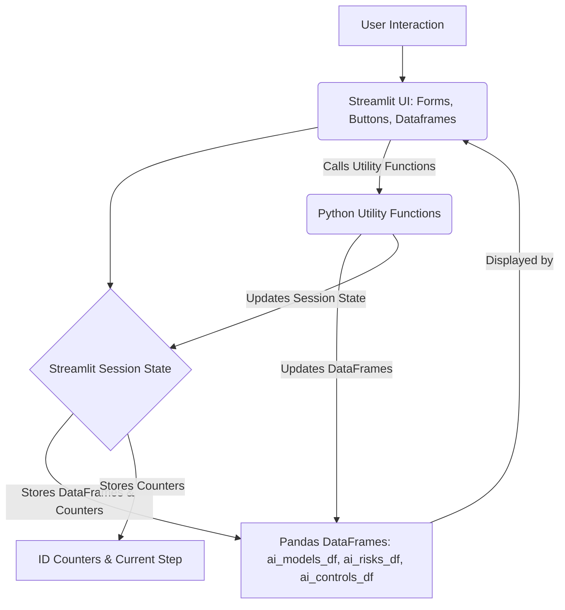

id: 6931d9ceca38c557e5169651_documentation
summary: AI Design and Deployment Lab 6 - Clone Documentation
feedback link: https://docs.google.com/forms/d/e/1FAIpQLSfWkOK-in_bMMoHSZfcIvAeO58PAH9wrDqcxnJABHaxiDqhSA/viewform?usp=sf_link
environments: Web
status: Published
# Building a Robust AI Model Risk Management System with Streamlit (QuLab)

## 1. Introduction: Sarah's Challenge and the QuLab Framework
Duration: 05:00

In this lab, you will step into the shoes of **Sarah, a Senior Risk Manager at QuantFinance Bank**. Her mission is to establish a robust framework for managing the unique risks posed by Artificial Intelligence (AI) models in the financial sector. This application will guide Sarah through a practical, end-to-end workflow, mirroring real-world tasks in her job rather than just showcasing theoretical concepts.

**The Core Challenge:** QuantFinance Bank relies heavily on AI for critical operations like credit assessment and fraud detection. However, these powerful tools introduce novel risks such as algorithmic bias, adversarial attacks, and data drift. Without a systematic approach, these risks can lead to significant financial losses, reputational damage, and regulatory penalties. Sarah is tasked with building a proactive and adaptive system to identify, assess, and manage these AI-specific risks, aligning with industry best practices and regulatory frameworks.

<aside class="positive">
This challenge directly references the principles of the **NIST AI Risk Management Framework (AI RMF)**, which emphasizes understanding, measuring, and managing risks throughout the AI lifecycle. This codelab will demonstrate a practical implementation of these concepts.
</aside>

**How this App Helps Sarah:** This interactive application serves as Sarah's workbench for AI risk management. Through a series of guided steps, she will:
- **Establish Foundations**: Initialize a central repository for AI models, risks, and controls.
- **Identify Risks**: Systematically use a structured taxonomy to identify various AI hazards.
- **Quantify & Prioritize**: Assign likelihood and magnitude scores to risks, calculating composite scores for effective prioritization.
- **Integrate Intelligence**: Incorporate insights from adversarial testing and supply chain analysis.
- **Mitigate & Respond**: Define controls and strategic responses for identified risks.
- **Monitor & Adapt**: Update risk assessments based on simulated operational alerts, demonstrating continuous validation.
- **Report Holistically**: Generate and interpret comprehensive risk registers and visualizations.

Each step in this workflow is designed to reflect Sarah's actual decision-making process, helping her apply crucial AI risk management concepts to real-world scenarios at QuantFinance Bank.

### Application Architecture Overview

The `QuLab` Streamlit application is structured to provide an interactive, step-by-step AI risk management workflow. It leverages Streamlit's capabilities for UI development and Pandas DataFrames for data management, all orchestrated through Python functions and Streamlit's `session_state` for persistence across interactions.

Here's a high-level overview of the architecture:



**Key Components:**
*   **Streamlit UI**: Provides the interactive elements (buttons, forms, sliders) and displays data (DataFrames, plots).
*   **Streamlit Session State (`st.session_state`)**: This is crucial for maintaining the state of the application across user interactions. It stores the Pandas DataFrames (models, risks, controls), unique ID counters, and the current step number, ensuring continuity as Sarah progresses through the workflow.
*   **Pandas DataFrames**: The backbone of the data management. `ai_models_df`, `ai_risks_df`, and `ai_controls_df` store all the structured information related to AI models, identified risks, and implemented controls, respectively.
*   **Python Utility Functions**: A set of helper functions (`add_ai_model_st`, `assign_risk_scores_st`, `plot_risk_distribution_by_type_st`, etc.) that encapsulate the business logic for managing the risk register. These functions interact directly with `st.session_state` to modify the underlying DataFrames.

This architecture enables a stateless web framework like Streamlit to simulate a stateful application, making the complex workflow manageable and intuitive.

<button>
  [Download `app.py`](https://raw.githubusercontent.com/username/repo/branch/app.py)
</button>
(Note: Replace the URL with the actual GitHub raw file link or another hosting if available)

## 2. Setting the Stage: Initializing QuantFinance Bank's AI Risk Management System
Duration: 02:00

Sarah's first step is to lay the groundwork for a robust AI risk management system. This involves setting up the core data structures that will store information about AI models, identified risks, and their associated controls. This centralized repository is crucial for maintaining a transparent and comprehensive overview of all AI-related risks across QuantFinance Bank, aligning with the "Centralized Repository" concept from the AI RMF.

This foundational setup enables a systematic record of identified AI hazards and risks, which is essential for proactive risk management and effective communication among stakeholders.

The initialization is handled by setting up `st.session_state` variables and calling `initialize_risk_management_system_st()`:

```python
#  Initialize session state variables if not already present 
if 'ai_models_df' not in st.session_state:
    st.session_state.ai_models_df = pd.DataFrame(columns=["model_id", "model_name", "use_case", "description", "owner", "status"])
    st.session_state.ai_risks_df = pd.DataFrame(columns=["risk_id", "model_id", "risk_type", "hazard_description", "likelihood_score", "magnitude_score", "composite_risk_score"])
    st.session_state.ai_controls_df = pd.DataFrame(columns=["control_id", "risk_id", "control_description", "effectiveness_score", "risk_response"])
    st.session_state.model_id_counter = 0
    st.session_state.risk_id_counter = 0
    st.session_state.control_id_counter = 0
    st.session_state.current_step = 1 # Start at step 1

# Utility function to reset/initialize
def initialize_risk_management_system_st():
    st.session_state.ai_models_df = pd.DataFrame(columns=["model_id", "model_name", "use_case", "description", "owner", "status"])
    st.session_state.ai_risks_df = pd.DataFrame(columns=["risk_id", "model_id", "risk_type", "hazard_description", "likelihood_score", "magnitude_score", "composite_risk_score"])
    st.session_state.ai_controls_df = pd.DataFrame(columns=["control_id", "risk_id", "control_description", "effectiveness_score", "risk_response"])
    st.session_state.model_id_counter = 0
    st.session_state.risk_id_counter = 0
    st.session_state.control_id_counter = 0
    st.success("AI Model Risk Register system initialized successfully.")

# UI interaction
if st.session_state.current_step == 1:
    st.subheader("1. Setting the Stage: Initializing QuantFinance Bank's AI Risk Management System")
    # ... markdown narrative ...
    if st.button("Initialize AI Risk Management System", key="init_system_btn"):
        initialize_risk_management_system_st()
        st.session_state.current_step = 2
        st.rerun()
```

<aside class="positive">
Using `st.session_state` is a best practice in Streamlit to maintain data and application state across reruns, making interactive, multi-step applications possible. The initial checks (`if 'ai_models_df' not in st.session_state:`) prevent re-initialization on every rerun if the data is already present.
</aside>

## 3. Defining Our AI Risk Taxonomy
Duration: 02:00

To ensure a consistent and comprehensive identification of AI-specific risks, Sarah needs a standardized taxonomy. This taxonomy categorizes risks across different dimensions—Data, Model, System, Human, and Organizational—providing a structured framework for assessment. This aligns with the "Risk Taxonomy" concept in the AI RMF, ensuring that all potential vulnerabilities are considered.

A well-defined taxonomy helps Sarah and her team systematically identify potential AI-specific hazards, such as data drift, adversarial attacks, algorithmic bias, or privacy breaches, ensuring comprehensive coverage and facilitating communication across different departments within QuantFinance Bank.

The taxonomy is stored in `st.session_state` as a dictionary, making it accessible throughout the application:

```python
if 'AI_RISK_TAXONOMY' not in st.session_state:
    st.session_state.AI_RISK_TAXONOMY = {
        "Data Risk": ["Data Quality", "Data Privacy", "Data Drift", "Data Poisoning", "Data Bias", "Data Provenance"],
        "Model Risk": ["Algorithmic Bias", "Fairness", "Explainability", "Robustness", "Performance Degradation", "Adversarial Attacks", "Concept Drift", "Model Interpretability"],
        "System Risk": ["Security Vulnerability", "Integration Issues", "Infrastructure Failure", "Access Control"],
        "Human Risk": ["Operator Error", "Misuse", "Lack of Oversight", "Ethical Misalignment"],
        "Organizational Risk": ["Regulatory Non-Compliance", "Reputational Damage", "Lack of Governance", "Third-Party Dependency"]
    }

# UI interaction
elif st.session_state.current_step == 2:
    st.subheader("2. Defining Our AI Risk Taxonomy")
    # ... markdown narrative ...
    st.json(st.session_state.AI_RISK_TAXONOMY)
    # ... info box ...
    if st.button("Acknowledge Taxonomy & Proceed to Model Registration", key="next_step2_btn"):
        st.session_state.current_step = 3
        st.rerun()
```

## 4. Registering a New AI Model: The Credit Score Predictor
Duration: 03:00

QuantFinance Bank is preparing to deploy a new AI-powered "Credit Score Predictor" model, which is critical for loan approvals. Sarah's immediate task is to formally register this model in the system, capturing its essential details, intended use, and initial status. This initial registration is a fundamental step in the AI RMF process, ensuring that every AI model under the bank's purview is documented from its inception.

By registering the model early, Sarah ensures that all subsequent risk assessments and control implementations are tied to a specific, well-defined AI asset, providing clear accountability and traceability.

The application uses a Streamlit form to capture model details and the `add_ai_model_st` function to add it to the `ai_models_df` DataFrame:

```python
# Utility function to add a model
def add_ai_model_st(model_name, use_case, description, owner, status="In Development"):
    st.session_state.model_id_counter += 1
    new_model = {
        "model_id": st.session_state.model_id_counter,
        "model_name": model_name,
        "use_case": use_case,
        "description": description,
        "owner": owner,
        "status": status
    }
    st.session_state.ai_models_df = pd.concat([st.session_state.ai_models_df, pd.DataFrame([new_model])], ignore_index=True)
    st.success(f"Model '{model_name}' (ID: {st.session_state.model_id_counter}) added successfully.")
    return st.session_state.model_id_counter

# UI interaction
elif st.session_state.current_step == 3:
    st.subheader("3. Registering a New AI Model: The Credit Score Predictor")
    # ... markdown narrative ...
    with st.form("add_model_form"):
        model_name = st.text_input("Model Name", "Credit Score Predictor", key="model_name_3")
        use_case = st.text_area("Use Case", "Automating credit risk assessment for loan applications", key="use_case_3")
        description = st.text_area("Description", "Machine learning model predicting creditworthiness based on financial history and demographic data.", key="description_3")
        owner = st.text_input("Owner", "Retail Banking Analytics", key="owner_3")
        status = st.selectbox("Status", ["In Development", "In Production", "Retired"], index=0, key="status_3")
        submitted = st.form_submit_button("Register AI Model")

        if submitted:
            if model_name not in st.session_state.ai_models_df['model_name'].values:
                new_model_id = add_ai_model_st(model_name, use_case, description, owner, status) 
                st.session_state.credit_score_predictor_model_id = new_model_id
            else:
                st.warning(f"Model '{model_name}' already registered. Using existing model ID.")
                st.session_state.credit_score_predictor_model_id = st.session_state.ai_models_df[st.session_state.ai_models_df['model_name'] == model_name]['model_id'].iloc[0]
            st.session_state.current_step = 4
            st.rerun()
```

## 5. Initial Risk Identification: Potential Hazards for the Credit Score Model
Duration: 04:00

With the Credit Score Predictor registered, Sarah begins the crucial process of identifying potential AI-specific hazards. She draws upon her expertise and the bank's risk taxonomy to foresee issues that could arise from data quality, model behavior, or operational deployment. This proactive identification is key to mitigating future problems and aligns with Section 4.2 of the AI RMF, focusing on "Risk Register: Identification and Categorization."

Sarah considers risks like "Data Quality" (poor input data leading to incorrect scores), "Algorithmic Bias" (unfair scoring for certain demographic groups), and "Performance Degradation" (the model's accuracy declining over time). This step is crucial for anticipating challenges and preventing negative impacts on customers and the bank's reputation.

The `add_ai_risk_st` utility function is used to add new risks to the `ai_risks_df` DataFrame:

```python
# Utility function to add a risk
def add_ai_risk_st(model_id, risk_type, hazard_description, likelihood_score=None, magnitude_score=None):
    st.session_state.risk_id_counter += 1
    new_risk = {
        "risk_id": st.session_state.risk_id_counter,
        "model_id": model_id,
        "risk_type": risk_type,
        "hazard_description": hazard_description,
        "likelihood_score": likelihood_score,
        "magnitude_score": magnitude_score,
        "composite_risk_score": None
    }
    st.session_state.ai_risks_df = pd.concat([st.session_state.ai_risks_df, pd.DataFrame([new_risk])], ignore_index=True)
    st.info(f"Risk '{hazard_description}' (ID: {st.session_state.risk_id_counter}) added for model {model_id}.")
    return st.session_state.risk_id_counter

# UI interaction
elif st.session_state.current_step == 4:
    st.subheader("4. Initial Risk Identification: Potential Hazards for the Credit Score Model")
    # ... markdown narrative ...
    credit_score_predictor_model_id = st.session_state.ai_models_df[st.session_state.ai_models_df['model_name'] == 'Credit Score Predictor']['model_id'].iloc[0] if 'Credit Score Predictor' in st.session_state.ai_models_df['model_name'].values else None

    if credit_score_predictor_model_id:
        st.write(f"Adding risks for model: **Credit Score Predictor** (ID: {credit_score_predictor_model_id})")
        
        risk_exists_dq = ((st.session_state.ai_risks_df['model_id'] == credit_score_predictor_model_id) & (st.session_state.ai_risks_df['risk_type'] == "Data Quality")).any()
        if st.button("Add Data Quality Risk", key="add_dq_risk", disabled=risk_exists_dq):
            add_ai_risk_st(credit_score_predictor_model_id, "Data Quality", "Poor or incomplete historical data leading to inaccurate credit scores.")
            st.rerun()
        # Similar buttons for Algorithmic Bias and Performance Degradation
        # ...
        if risk_exists_dq and risk_exists_ab and risk_exists_pd and st.button("Proceed to Quantify Risks", key="next_step4_btn"):
            st.session_state.current_step = 5
            st.rerun()
```

## 6. Quantifying Risk: Likelihood and Magnitude Assessment
Duration: 04:00

Identifying risks is only the first step; Sarah now needs to quantify them to understand their potential impact. For each identified risk, she will assess its likelihood of occurrence ($P(\text{event})$) and the magnitude of potential harm ($M(\text{consequence})$). This quantitative and qualitative assessment is fundamental to the AI RMF (Section 4.2), as it allows for a standardized way to prioritize risks across the bank's AI portfolio.

The core formula for this assessment is:
$$ \text{Risk} = P(\text{event}) \times M(\text{consequence}) $$
where $P(\text{event})$ represents the likelihood of a risk event occurring, and $M(\text{consequence})$ represents the severity of the impact if the event occurs. These scores will typically be qualitative (e.g., Low, Medium, High) mapped to numerical scales (e.g., 1-5).

Streamlit sliders are used to capture the likelihood and magnitude scores, and the `assign_risk_scores_st` function updates the `ai_risks_df`:

```python
# Utility function to assign scores
def assign_risk_scores_st(risk_id, likelihood, magnitude):
    if risk_id in st.session_state.ai_risks_df['risk_id'].values:
        st.session_state.ai_risks_df.loc[st.session_state.ai_risks_df['risk_id'] == risk_id, 'likelihood_score'] = likelihood
        st.session_state.ai_risks_df.loc[st.session_state.ai_risks_df['risk_id'] == risk_id, 'magnitude_score'] = magnitude
        st.info(f"Assigned likelihood ({likelihood}) and magnitude ({magnitude}) scores for risk ID {risk_id}.")
    else:
        st.warning(f"Risk ID {risk_id} not found.")

# UI interaction
elif st.session_state.current_step == 5:
    st.subheader("5. Quantifying Risk: Likelihood and Magnitude Assessment")
    # ... markdown narrative ...
    risks_to_score = st.session_state.ai_risks_df[
        (st.session_state.ai_risks_df['likelihood_score'].isna()) | 
        (st.session_state.ai_risks_df['magnitude_score'].isna())
    ].copy()

    if not risks_to_score.empty:
        with st.form("assign_scores_form"):
            for index, risk in risks_to_score.iterrows():
                st.markdown(f"**Risk ID: {int(risk['risk_id'])}**")
                st.write(f"Type: {risk['risk_type']}")
                st.write(f"Hazard: {risk['hazard_description']}")
                
                likelihood = st.slider(f"Likelihood (1-5) for Risk ID {int(risk['risk_id'])}: How frequently is this risk likely to occur?", 1, 5, 3, key=f"likelihood_{int(risk['risk_id'])}")
                magnitude = st.slider(f"Magnitude (1-5) for Risk ID {int(risk['risk_id'])}: How severe would the impact be if this risk materializes?", 1, 5, 3, key=f"magnitude_{int(risk['risk_id'])}")
                scored_risks_data.append({'risk_id': int(risk['risk_id']), 'likelihood': likelihood, 'magnitude': magnitude})
                st.markdown("")
            
            submitted_scores = st.form_submit_button("Assign All Scores")
            if submitted_scores:
                for score_data in scored_risks_data:
                    assign_risk_scores_st(score_data['risk_id'], score_data['likelihood'], score_data['magnitude'])
                st.session_state.current_step = 6
                st.rerun()
```

## 7. Calculating the Composite Risk Score
Duration: 03:00

With likelihood and magnitude scores assigned, Sarah can now calculate the composite risk score for each hazard. This score, derived from the formula $Risk = P(\text{event}) \times M(\text{consequence})$, provides a single, aggregated metric for each risk, allowing for easy comparison and prioritization. This calculation is a direct application of the "Quantitative and Qualitative Assessment" mentioned in the AI RMF (Section 4.2).

By standardizing risk quantification, Sarah ensures that all stakeholders at QuantFinance Bank can understand and compare the severity of different AI risks, guiding resource allocation for risk mitigation. A higher composite score indicates greater urgency for mitigation, helping Sarah prioritize her efforts effectively.

The `calculate_composite_risk_score_st` function performs the multiplication and updates the DataFrame:

```python
# Utility function to calculate composite score
def calculate_composite_risk_score_st(risk_id):
    if risk_id in st.session_state.ai_risks_df['risk_id'].values:
        likelihood = st.session_state.ai_risks_df.loc[st.session_state.ai_risks_df['risk_id'] == risk_id, 'likelihood_score'].iloc[0]
        magnitude = st.session_state.ai_risks_df.loc[st.session_state.ai_risks_df['risk_id'] == risk_id, 'magnitude_score'].iloc[0]
        if pd.notna(likelihood) and pd.notna(magnitude):
            composite_score = likelihood * magnitude
            st.session_state.ai_risks_df.loc[st.session_state.ai_risks_df['risk_id'] == risk_id, 'composite_risk_score'] = composite_score
            st.success(f"Calculated composite risk score ({composite_score}) for risk ID {risk_id}.")
        else:
            st.warning(f"Likelihood or magnitude scores missing for risk ID {risk_id}. Cannot calculate composite score.")
    else:
        st.warning(f"Risk ID {risk_id} not found.")

# UI interaction
elif st.session_state.current_step == 6:
    st.subheader("6. Calculating the Composite Risk Score")
    # ... markdown narrative ...
    uncalculated_risks = st.session_state.ai_risks_df[
        st.session_state.ai_risks_df['composite_risk_score'].isna() &
        st.session_state.ai_risks_df['likelihood_score'].notna() &
        st.session_state.ai_risks_df['magnitude_score'].notna()
    ]

    if not uncalculated_risks.empty:
        if st.button("Calculate All Composite Risk Scores", key="calculate_composite_btn"):
            for risk_id in uncalculated_risks['risk_id']:
                calculate_composite_risk_score_st(int(risk_id))
            st.session_state.current_step = 7
            st.rerun()
```

## 8. Integrating Insights from Adversarial Testing: Uncovering Robustness Risks
Duration: 05:00

QuantFinance Bank's dedicated Red-Teaming unit has just concluded an exercise targeting the Credit Score Predictor. Their findings reveal vulnerabilities to "Adversarial Attacks" – subtle manipulations of input data that can cause misclassification (e.g., making a high-risk applicant appear low-risk). Sarah must immediately integrate these critical insights into the risk register. This directly reflects the importance of "Adversarial Testing and Red-Teaming" (Section 2) in the AI RMF for uncovering AI-specific security vulnerabilities like "Deceptive Inputs" (2.2) and "Data Poisoning Attacks" (2.4).

By documenting these specific threats, Sarah ensures the bank can develop targeted defenses, preventing malicious actors from exploiting the model and protecting the integrity of loan decisions.

The `add_adversarial_risk_st` function simplifies adding and scoring these specialized risks:

```python
# Utility function for adversarial risks
def add_adversarial_risk_st(model_id, attack_type, description, likelihood, magnitude):
    risk_type = "Model Risk"
    new_risk_id = add_ai_risk_st(model_id, risk_type, f"{attack_type}: {description}")
    assign_risk_scores_st(new_risk_id, likelihood, magnitude)
    calculate_composite_risk_score_st(new_risk_id)
    st.success(f"Adversarial risk '{attack_type}' (ID: {new_risk_id}) added and scored for model {model_id}.")
    return new_risk_id

# UI interaction
elif st.session_state.current_step == 7:
    st.subheader("7. Integrating Insights from Adversarial Testing: Uncovering Robustness Risks")
    # ... markdown narrative ...
    credit_score_predictor_model_id = st.session_state.ai_models_df[st.session_state.ai_models_df['model_name'] == 'Credit Score Predictor']['model_id'].iloc[0] # ... check if exists ...

    if credit_score_predictor_model_id:
        with st.form("add_adversarial_risk_form"):
            attack_type = st.text_input("Adversarial Attack Type", "Adversarial Attack (Evasion)", key="attack_type_7", disabled=adversarial_risk_already_added)
            description = st.text_area("Description", "Subtle manipulation of input features to cause a misclassification of a high-risk individual as low-risk.", key="description_7", disabled=adversarial_risk_already_added)
            likelihood = st.slider("Likelihood (1-5)", 1, 5, 4, key="adv_likelihood_7", disabled=adversarial_risk_already_added)
            magnitude = st.slider("Magnitude (1-5)", 1, 5, 5, key="adv_magnitude_7", disabled=adversarial_risk_already_added)
            submitted = st.form_submit_button("Add Adversarial Risk & Score", disabled=adversarial_risk_already_added)

            if submitted:
                add_adversarial_risk_st(credit_score_predictor_model_id, attack_type, description, likelihood, magnitude)
                st.session_state.current_step = 8
                st.rerun()
```

## 9. Addressing Supply Chain and Data Provenance Risks
Duration: 05:00

Beyond direct model vulnerabilities, Sarah also considers the broader "AI Supply Chain" (Section 3). A recent internal review highlighted potential data provenance issues for a separate "Fraud Detection System" and its reliance on a critical third-party feature engineering library. Sarah needs to register these "Data Provenance" (3.2) and "Third-Party Dependency" (3.3) risks. This is critical for understanding risks related to data quality, integrity, and external components, concepts that are central to maintaining the trustworthiness of AI systems.

Ensuring the quality and origin of data, as well as vetting third-party components, helps Sarah manage cascading vulnerabilities and maintain the overall security of QuantFinance Bank's AI portfolio.

The `add_supply_chain_risk_st` function handles both model registration (if needed) and risk addition for these types of risks:

```python
# Utility function for supply chain risks
def add_supply_chain_risk_st(model_name, model_use_case, model_description, model_owner, model_status, risk_type, hazard_description, likelihood, magnitude):
    existing_model = st.session_state.ai_models_df[st.session_state.ai_models_df['model_name'] == model_name]
    if not existing_model.empty:
        model_id = existing_model['model_id'].iloc[0]
        st.info(f"Model '{model_name}' (ID: {model_id}) already exists. Using existing model_id.")
    else:
        model_id = add_ai_model_st(model_name, model_use_case, model_description, model_owner, model_status)

    new_risk_id = add_ai_risk_st(model_id, risk_type, hazard_description)
    assign_risk_scores_st(new_risk_id, likelihood, magnitude)
    calculate_composite_risk_score_st(new_risk_id)
    st.success(f"Supply chain/data provenance risk '{hazard_description}' (ID: {new_risk_id}) added and scored for model {model_id}.")
    return model_id, new_risk_id

# UI interaction
elif st.session_state.current_step == 8:
    st.subheader("8. Addressing Supply Chain and Data Provenance Risks")
    # ... markdown narrative ...
    fraud_detection_model_name = "Fraud Detection System"
    # ... logic to check and add fraud detection model if not present ...

    if fraud_model_id:
        st.markdown("### Add Data Provenance Risk for Fraud Detection System")
        with st.form("add_data_provenance_risk_form"):
            dp_hazard_description = st.text_area("Hazard Description (Data Provenance)", "Lack of verifiable data provenance...", key="dp_desc_8", disabled=data_provenance_risk_exists)
            dp_likelihood = st.slider("Likelihood (1-5)", 1, 5, 3, key="dp_likelihood_8", disabled=data_provenance_risk_exists)
            dp_magnitude = st.slider("Magnitude (1-5)", 1, 5, 4, key="dp_magnitude_8", disabled=data_provenance_risk_exists)
            dp_submitted = st.form_submit_button("Add Data Provenance Risk", disabled=data_provenance_risk_exists)

            if dp_submitted:
                add_supply_chain_risk_st(
                    model_name=fraud_detection_model_name, model_use_case="", model_description="", model_owner="", model_status="",
                    risk_type="Data Provenance", hazard_description=dp_hazard_description, likelihood=dp_likelihood, magnitude=dp_magnitude
                )
                st.rerun()
        # Similar form for Third-Party Dependency Risk
        # ...
```

## 10. Defining Controls and Mitigation Strategies
Duration: 04:00

Having identified and quantified several risks, Sarah's next crucial step is to define and propose specific controls to mitigate them. This involves designing defenses tailored to each identified risk, from technical measures like input sanitization to procedural controls like regular model retraining. This directly applies the "Risk Controls and Mitigation Strategies" concept from the AI RMF (Section 4.3), emphasizing "Mapping Controls to Risks" and "Hierarchical Control Design."

By establishing clear controls, Sarah ensures that QuantFinance Bank has concrete plans to reduce the likelihood or impact of identified risks, thereby strengthening the overall resilience of its AI systems against threats like adversarial attacks and data quality issues.

The `add_ai_control_st` function is used to add control descriptions linked to specific risk IDs:

```python
# Utility function to add a control
def add_ai_control_st(risk_id, control_description):
    st.session_state.control_id_counter += 1
    new_control = {
        "control_id": st.session_state.control_id_counter,
        "risk_id": risk_id,
        "control_description": control_description,
        "effectiveness_score": None,
        "risk_response": None
    }
    st.session_state.ai_controls_df = pd.concat([st.session_state.ai_controls_df, pd.DataFrame([new_control])], ignore_index=True)
    st.success(f"Control '{control_description}' (ID: {st.session_state.control_id_counter}) added for risk ID {risk_id}.")
    return st.session_state.control_id_counter

# UI interaction
elif st.session_state.current_step == 9:
    st.subheader("9. Defining Controls and Mitigation Strategies")
    # ... markdown narrative ...
    # Identify risk IDs dynamically from session state DataFrames
    algorithmic_bias_risk_id = st.session_state.ai_risks_df[st.session_state.ai_risks_df['hazard_description'].str.contains('Algorithmic Bias', na=False)]['risk_id'].iloc[0] # ... check if exists ...
    # Similar for adversarial_attack_risk_id, data_provenance_risk_id

    controls_to_add = [
        (algorithmic_bias_risk_id, "Implement fairness metrics monitoring...", "Algorithmic Bias"),
        (adversarial_attack_risk_id, "Implement adversarial training techniques...", "Adversarial Attack"),
        (data_provenance_risk_id, "Establish clear data lineage tracking...", "Data Provenance")
    ]

    all_controls_added = True
    for risk_id, control_desc, risk_name in controls_to_add:
        if risk_id is not None:
            control_exists = (st.session_state.ai_controls_df['risk_id'] == risk_id).any()
            if st.button(f"Add Control for {risk_name} (Risk ID: {int(risk_id)})", key=f"add_control_for_{risk_id}", disabled=control_exists):
                add_ai_control_st(risk_id, control_desc)
                st.rerun()
            # ... else/info message ...
        else:
            st.warning(f"Risk '{risk_name}' not found. Please ensure it was added in previous steps.")
            all_controls_added = False
    
    if all_controls_added and st.button("Proceed to Assign Risk Response Options", key="next_step9_btn"):
        st.session_state.current_step = 10
        st.rerun()
```

## 11. Assigning Risk Response Options
Duration: 04:00

For each identified risk with its proposed controls, Sarah must now formalize the bank's "Risk Response Option" (Section 4.3). This involves deciding whether to mitigate, transfer, avoid, or accept the risk based on the severity of the residual risk (after controls) and the bank's overall risk tolerance. This strategic decision-making is a core part of the AI RMF, ensuring that every risk has a clear management plan.

This step helps Sarah communicate to stakeholders exactly how each AI risk will be handled, ensuring alignment with the bank's broader risk appetite and regulatory requirements.

Streamlit select boxes are used for choosing the risk response, and the `assign_risk_response_st` function updates the controls DataFrame:

```python
# Utility function to assign risk response
def assign_risk_response_st(control_id, effectiveness_score, risk_response):
    if control_id in st.session_state.ai_controls_df['control_id'].values:
        st.session_state.ai_controls_df.loc[st.session_state.ai_controls_df['control_id'] == control_id, 'effectiveness_score'] = effectiveness_score
        st.session_state.ai_controls_df.loc[st.session_state.ai_controls_df['control_id'] == control_id, 'risk_response'] = risk_response
        st.info(f"Assigned effectiveness score ({effectiveness_score}) and risk response ('{risk_response}') for control ID {control_id}.")
    else:
        st.warning(f"Control ID {control_id} not found.")

# UI interaction
elif st.session_state.current_step == 10:
    st.subheader("10. Assigning Risk Response Options")
    # ... markdown narrative ...
    controls_to_respond = st.session_state.ai_controls_df[
        (st.session_state.ai_controls_df['effectiveness_score'].isna()) | 
        (st.session_state.ai_controls_df['risk_response'].isna())
    ].copy()

    if not controls_to_respond.empty:
        with st.form("assign_responses_form"):
            for index, control in controls_to_respond.iterrows():
                st.markdown(f"**Control ID: {int(control['control_id'])}**")
                st.write(f"Description: {control['control_description']}")
                
                effectiveness = st.slider(f"Effectiveness Score (1-5) for Control ID {int(control['control_id'])}: How effective is this control at reducing the risk?", 1, 5, 4, key=f"effectiveness_{int(control['control_id'])}")
                risk_response = st.selectbox(f"Risk Response for Control ID {int(control['control_id'])}: What is the bank's strategy for this risk?", ["Mitigate", "Transfer", "Avoid", "Accept"], key=f"response_{int(control['control_id'])}")
                responded_controls_data.append({'control_id': int(control['control_id']), 'effectiveness': effectiveness, 'risk_response': risk_response})
                st.markdown("")
            
            submitted_responses = st.form_submit_button("Assign All Responses")
            if submitted_responses:
                for response_data in responded_controls_data:
                    assign_risk_response_st(response_data['control_id'], response_data['effectiveness'], response_data['risk_response'])
                st.session_state.current_step = 11
                st.rerun()
```

## 12. Reviewing the Comprehensive AI Model Risk Register
Duration: 03:00

At this stage, Sarah needs to review the entire AI Model Risk Register to get a holistic view of the bank's AI risk landscape. This comprehensive display, integrating models, risks, assessments, and controls, is the "Centralized Repository" described in the AI RMF (Section 4.2). It allows Sarah to verify that all necessary information is captured and interconnected.

This unified view is essential for Sarah to present to internal audit and senior management, demonstrating transparent and systematic AI risk governance across QuantFinance Bank.

The `get_full_risk_register_st` function merges the individual DataFrames (`ai_models_df`, `ai_risks_df`, `ai_controls_df`) to create a single, comprehensive view:

```python
# Utility function to get full risk register
def get_full_risk_register_st():
    merged_df = pd.merge(st.session_state.ai_models_df, st.session_state.ai_risks_df, on='model_id', how='left')
    full_register_df = pd.merge(merged_df, st.session_state.ai_controls_df, on='risk_id', how='left')
    selected_columns = [
        'model_name', 'use_case', 'description_x', 'owner', 'status',
        'risk_type', 'hazard_description', 'likelihood_score', 'magnitude_score', 'composite_risk_score',
        'control_description', 'effectiveness_score', 'risk_response'
    ]
    full_register_df = full_register_df[selected_columns]
    full_register_df = full_register_df.rename(columns={'description_x': 'model_description'})
    st.session_state.full_risk_register_df = full_register_df
    st.success("Comprehensive AI Model Risk Register generated.")

# UI interaction
elif st.session_state.current_step == 11:
    st.subheader("11. Reviewing the Comprehensive AI Model Risk Register")
    # ... markdown narrative ...
    if st.button("Generate Comprehensive AI Model Risk Register", key="generate_full_register_btn"):
        get_full_risk_register_st()
        st.session_state.current_step = 12
        st.rerun()
    
    if 'full_risk_register_df' in st.session_state and not st.session_state.full_risk_register_df.empty:
        st.markdown("\nComprehensive AI Model Risk Register:")
        st.dataframe(st.session_state.full_risk_register_df, use_container_width=True)
        if st.button("Proceed to Analyze Top Risks", key="next_step11_btn_after_gen"):
            st.session_state.current_step = 12
            st.rerun()
```

## 13. Analyzing and Prioritizing High-Scoring Risks
Duration: 03:00

With a growing number of AI models and associated risks, Sarah needs an efficient way to identify and prioritize the most critical threats. Analyzing risks by their `composite_risk_score` allows her to pinpoint the highest-scoring hazards, ensuring that resources and attention are directed where they are most needed. This aligns with the AI RMF's principle of "Risk-based" decision-making.

This analysis helps Sarah focus on the "top risks" that pose the greatest potential harm to QuantFinance Bank, enabling proactive resource allocation and strategic risk mitigation.

The `identify_top_risks_st` function sorts the full risk register by the composite score to identify the most critical risks:

```python
# Utility function to identify top risks
def identify_top_risks_st(num_top_risks=5):
    if not st.session_state.full_risk_register_df.empty:
        df_sorted = st.session_state.full_risk_register_df.sort_values(by='composite_risk_score', ascending=False, na_position='last')
        top_risks = df_sorted.head(num_top_risks)
        st.session_state.top_risks_df = top_risks
        st.success(f"Top {num_top_risks} risks identified.")
    else:
        st.warning("Full risk register is empty. Cannot identify top risks.")

# UI interaction
elif st.session_state.current_step == 12:
    st.subheader("12. Analyzing and Prioritizing High-Scoring Risks")
    # ... markdown narrative ...
    if 'full_risk_register_df' in st.session_state and not st.session_state.full_risk_register_df.empty:
        num_top_risks = st.number_input("Number of Top Risks to Display", min_value=1, value=3, step=1, key="num_top_risks_12")
        if st.button("Identify Top Risks", key="identify_top_risks_btn"):
            identify_top_risks_st(num_top_risks)
            st.session_state.current_step = 13
            st.rerun()

        if 'top_risks_df' in st.session_state and not st.session_state.top_risks_df.empty:
            st.markdown(f"\nTop {num_top_risks} AI Risks by Composite Score (highest first):")
            st.dataframe(st.session_state.top_risks_df, use_container_width=True)
            if st.button("Proceed to Visualize Risk Distribution", key="next_step12_btn_after_id"):
                st.session_state.current_step = 13
                st.rerun()
```

## 14. Visualizing Risk Distribution by Type
Duration: 04:00

To provide an executive overview of the bank's overall AI risk posture, Sarah wants to visualize how identified risks are distributed across the different categories defined in the AI Risk Taxonomy (e.g., Data, Model, System). This aggregation helps in understanding systemic weaknesses and informs strategic investments in risk management capabilities. This type of visualization supports the "MEASURE" function of the AI RMF and provides an aggregated view of risks.

By visualizing the distribution, Sarah can identify if a particular risk category (e.g., "Model Risk") is disproportionately high, indicating a need for more robust controls or new policies in that area.

The `plot_risk_distribution_by_type_st` function uses `matplotlib` and `seaborn` to generate a bar chart, displayed via `st.pyplot()`:

```python
# Utility function to plot risk distribution
def plot_risk_distribution_by_type_st():
    if not st.session_state.ai_risks_df.empty:
        category_map = {}
        for category, types in st.session_state.AI_RISK_TAXONOMY.items():
            for t in types:
                category_map[t] = category
        
        if 'risk_type' in st.session_state.ai_risks_df.columns:
            st.session_state.ai_risks_df['broad_risk_category'] = st.session_state.ai_risks_df['risk_type'].map(category_map)
            risk_counts = st.session_state.ai_risks_df.dropna(subset=['broad_risk_category'])['broad_risk_category'].value_counts().reset_index()
            risk_counts.columns = ['Broad Risk Category', 'Number of Risks']

            if not risk_counts.empty:
                fig, ax = plt.subplots(figsize=(10, 6))
                sns.barplot(x='Broad Risk Category', y='Number of Risks', data=risk_counts, palette='viridis', ax=ax)
                ax.set_title('Distribution of AI Risks by Broad Category')
                ax.set_xlabel('Broad Risk Category')
                ax.set_ylabel('Number of Risks')
                plt.xticks(rotation=45, ha='right')
                plt.tight_layout()
                st.pyplot(fig)
                plt.close(fig) # Important to close the figure to prevent memory issues
                st.caption("This visualization provides Sarah with a high-level understanding of where QuantFinance Bank's AI risks are concentrated.")
            else:
                st.warning("No broad risk categories found to plot distribution after mapping.")
        else:
            st.warning("No 'risk_type' column found in AI risks data to plot distribution.")
    else:
        st.warning("No risks identified yet to plot distribution.")

# UI interaction
elif st.session_state.current_step == 13:
    st.subheader("13. Visualizing Risk Distribution by Type")
    # ... markdown narrative ...
    if st.button("Generate Risk Distribution Chart", key="plot_risk_dist_btn"):
        plot_risk_distribution_by_type_st()
        st.session_state.current_step = 14
        st.rerun()
```

## 15. Simulating Operational Monitoring Feedback: Detecting Data Drift
Duration: 04:00

AI risk management is not a one-time activity; it requires continuous vigilance. Sarah receives an alert from the bank's model monitoring system for the Credit Score Predictor, indicating a significant "Data Drift" (1.4.1) in the input features. This operational feedback is a critical trigger for re-evaluating the associated risks and exemplifies the "Continuous Validation" (4.5) aspect of the AI RMF.

This scenario demonstrates the necessity of an "Adaptive Cycle" or "outer loop" (1.4.3), where operational data constantly informs risk assessment, prompting Sarah to re-evaluate and update the risk register to maintain trust and performance.

The `simulate_data_drift_alert_st` function either updates an existing 'Data Drift' risk or adds a new one, then re-calculates its composite score:

```python
# Utility function to simulate data drift
def simulate_data_drift_alert_st(model_id, risk_type_to_update, hazard_description_if_new, new_likelihood, new_magnitude):
    existing_risk_row = st.session_state.ai_risks_df[(st.session_state.ai_risks_df['model_id'] == model_id) & (st.session_state.ai_risks_df['risk_type'] == risk_type_to_update)]

    if not existing_risk_row.empty:
        risk_id = existing_risk_row['risk_id'].iloc[0]
        st.info(f"Updating existing risk ID {risk_id} for '{risk_type_to_update}' (model ID: {model_id}).")
        assign_risk_scores_st(risk_id, new_likelihood, new_magnitude)
        calculate_composite_risk_score_st(risk_id)
    else:
        st.info(f"Adding new risk '{risk_type_to_update}' for model ID: {model_id}.")
        risk_id = add_ai_risk_st(model_id, risk_type_to_update, hazard_description_if_new, new_likelihood, new_magnitude)
        calculate_composite_risk_score_st(risk_id)
    st.warning("Data drift alert processed and risk assessment updated to reflect the new operational reality.")
    return risk_id

# UI interaction
elif st.session_state.current_step == 14:
    st.subheader("14. Simulating Operational Monitoring Feedback: Detecting Data Drift")
    # ... markdown narrative ...
    credit_score_predictor_model_id = st.session_state.ai_models_df[st.session_state.ai_models_df['model_name'] == 'Credit Score Predictor']['model_id'].iloc[0] # ... check if exists ...

    if credit_score_predictor_model_id:
        st.info(f"Simulating data drift alert for model: **Credit Score Predictor** (ID: {credit_score_predictor_model_id})")
        data_drift_risk_exists = ((st.session_state.ai_risks_df['model_id'] == credit_score_predictor_model_id) & 
                                  (st.session_state.ai_risks_df['risk_type'] == "Data Drift")).any()

        with st.form("simulate_drift_form"):
            st.text_input("Simulated Alert: Risk Type", "Data Drift", disabled=True, key="drift_risk_type_14")
            hazard_description = st.text_area("Hazard Description (Data Drift)", "Significant shift in demographic distribution...", key="drift_hazard_14", disabled=data_drift_risk_exists)
            new_likelihood = st.slider("New Likelihood (1-5)", 1, 5, 4, key="drift_likelihood_14", disabled=data_drift_risk_exists)
            new_magnitude = st.slider("New Magnitude (1-5)", 1, 5, 4, key="drift_magnitude_14", disabled=data_drift_risk_exists)
            submitted = st.form_submit_button("Simulate Data Drift & Update Risk", disabled=data_drift_risk_exists)

            if submitted:
                simulate_data_drift_alert_st(
                    credit_score_predictor_model_id,
                    "Data Drift",
                    hazard_description,
                    new_likelihood,
                    new_magnitude
                )
                st.session_state.current_step = 15
                st.rerun()
```

## 16. Updating Risk Assessment based on Monitoring Feedback
Duration: 03:00

Following the data drift alert, Sarah must now formally update the risk assessment for the "Credit Score Predictor". This involves adjusting the likelihood and/or magnitude scores for relevant risks, such as "Performance Degradation" or the newly identified "Data Drift," to reflect the new operational reality. This exemplifies "Continuous Validation" and "Post-Deployment Monitoring" (4.5), which are essential for maintaining the trustworthiness of adaptive AI systems.

By continuously refining risk assessments based on real-time monitoring, Sarah ensures that the risk register remains a living document that accurately reflects the current state of AI risks at QuantFinance Bank, supporting agile risk management.

The `update_risk_assessment_from_monitoring_st` function is used to adjust the scores for existing risks:

```python
# Utility function to update risk assessment
def update_risk_assessment_from_monitoring_st(model_id, target_risk_type, updated_likelihood, updated_magnitude):
    target_risk_row = st.session_state.ai_risks_df[(st.session_state.ai_risks_df['model_id'] == model_id) & (st.session_state.ai_risks_df['risk_type'] == target_risk_type)]

    if not target_risk_row.empty:
        risk_id = target_risk_row['risk_id'].iloc[0]
        st.info(f"Updating risk assessment for risk ID {risk_id} ('{target_risk_type}') for model ID {model_id}.")
        assign_risk_scores_st(risk_id, updated_likelihood, updated_magnitude)
        calculate_composite_risk_score_st(risk_id)
    else:
        st.warning(f"Risk type '{target_risk_type}' not found for model ID {model_id}. No update performed.")
    st.success("Risk assessment formally updated based on monitoring feedback.")

# UI interaction
elif st.session_state.current_step == 15:
    st.subheader("15. Updating Risk Assessment based on Monitoring Feedback")
    # ... markdown narrative ...
    credit_score_predictor_model_id = st.session_state.ai_models_df[st.session_state.ai_models_df['model_name'] == 'Credit Score Predictor']['model_id'].iloc[0] # ... check if exists ...

    if credit_score_predictor_model_id:
        st.info("The data drift event directly impacts the model's 'Performance Degradation' risk, requiring an update to its assessment.")
        
        target_risk_type = "Performance Degradation"
        updated_likelihood_val = 4
        updated_magnitude_val = 4

        # ... logic to check if already updated ...
        
        if not is_updated:
            st.markdown("Updating 'Performance Degradation' risk based on the data drift event:")
            if st.button("Formally Update Performance Degradation Risk", key="update_perf_degrad_btn"):
                update_risk_assessment_from_monitoring_st(
                    credit_score_predictor_model_id,
                    target_risk_type,
                    updated_likelihood_val,
                    updated_magnitude_val
                )
                st.session_state.current_step = 16 # Advance to a final summary view
                st.rerun()
        else:
            st.info("The 'Performance Degradation' risk has already been updated to reflect the operational feedback. Proceed to final summary.")
            if st.button("Proceed to Final Summary", key="proceed_final_summary_btn"):
                st.session_state.current_step = 16
                st.rerun()
```

## 17. Conclusion: Completing Sarah's AI Risk Management Journey
Duration: 02:00

Sarah has successfully navigated the complex landscape of AI risk management. From initial system setup and model registration to identifying, assessing, mitigating, and continuously monitoring risks—she has built a comprehensive and adaptive AI risk posture for QuantFinance Bank.

This continuous feedback loop ensures that the bank's AI models remain trustworthy and perform reliably in evolving environments. Congratulations on establishing a robust AI risk management framework!

This final step provides a summary of the work done, displaying the final state of the risk register and relevant visualizations:

```python
# Final Summary / Completion Page (Step 16)
elif st.session_state.current_step == 16:
    st.subheader("AI Risk Management Workflow Completed!")
    # ... markdown narrative ...
    st.balloons()
    
    st.markdown("### Final Comprehensive AI Model Risk Register")
    if 'full_risk_register_df' not in st.session_state or st.session_state.full_risk_register_df.empty:
        get_full_risk_register_st() # Ensure it's generated if skipped
    st.dataframe(st.session_state.full_risk_register_df, use_container_width=True)

    st.markdown("### Final Top Risks Overview")
    if 'top_risks_df' not in st.session_state or st.session_state.top_risks_df.empty:
        identify_top_risks_st(num_top_risks=3) # Default 3 for summary if not already set
    st.dataframe(st.session_state.top_risks_df, use_container_width=True)

    st.markdown("### Overall AI Risk Distribution")
    plot_risk_distribution_by_type_st()

    st.success("Sarah has established a robust AI risk management framework!")
    if st.button("Restart Workflow", key="reset_app_final"):
        st.session_state.clear()
        st.rerun()
```
